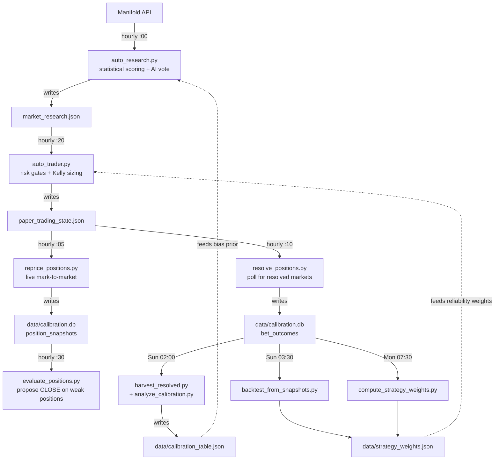

# Manifold Trading Bot

> **Status: parked.** Active development ran from March 2026 through May 2026. The code is preserved as a portfolio piece and the system continues running on a sandbox server as a live demo, but no new features are planned. This was a research project executed against [Manifold Markets](https://manifold.markets), which is a play-money (Mana) prediction-market venue, not a real-money trading platform.

## What it is

An end-to-end automated trading system for prediction markets. It fetches live markets every hour, scores each one with six statistical strategies plus a local LLM, sizes positions with risk-aware Kelly, executes paper trades, tracks predicted vs realized P&L, and updates per-strategy reliability weights weekly from resolved bet outcomes. Operations run on OS cron with no LLM in the scheduling loop; logs go to disk and a Telegram channel.

The project was a deliberate research vehicle: experiment with calibration-aware betting, asymmetric weight-update policies, AI-assisted market analysis, and disciplined defensive gating, on a public, free, programmable venue. By design it never traded real money. After roughly seven weeks of active development, 33 merged pull requests, and 1,121 resolved markets accumulated in the calibration corpus, the project was parked. The infrastructure is real and reusable; the Manifold-specific trading edge wasn't there in a way that justified continued engineering investment, and the natural pivot path (Polymarket, Kalshi) needs different infrastructure than this repo was built for.

## Technical highlights

For a quant or backend lead reading this cold:

- **Calibration pipeline** grounded in 1,121 resolved markets, with per-(category, probability bucket) bias modeling. A `min_cell_samples=15` sample-size gate suppresses noisy cells. The runtime lookup chain is per-(category, bucket) → per-(global bucket) → `bias=0`, so well-sampled specific cells override coarser priors. Source: [data/calibration_table.json](data/calibration_table.json), [scripts/analyze_calibration.py](scripts/analyze_calibration.py).
- **Six strategies** across `momentum` / `contrarian` / `fundamental` families, each with an explicit hypothesis. Family-level deduplication enforces at most one signal per family in any trade decision, which prevents correlated strategies from being counted as independent evidence. Strategies: `probability_direction`, `mean_reversion`, `probability_bias`, `creator_disagreement`, `thin_market`, `volume_spike_priority`. Source: [manifold_bot/strategies.py](manifold_bot/strategies.py).
- **Snapshot reconstruction** so backtests do not wait months for live trades to resolve. `scripts/reconstruct_snapshots.py` rebuilds the historical (probability, liquidity, volume) trajectory of resolved markets directly from the public Manifold API, which bootstraps the calibration loop from a much larger sample than the bot's own trade history.
- **Asymmetric backtest weight clamping** to prevent phantom-edge over-fitting. Backtest weights below 1.0 (a strategy is bad, dampen it) are accepted as-is; backtest weights above 1.0 (a strategy is good, amplify it) are clamped to 1.0 unless live trades have cleared the per-strategy sample-size threshold. The asymmetry is intentional: an over-eager backtest can manufacture confidence on stale reconstructed data; an over-cautious backtest only costs missed upside, which is recoverable. Source: [scripts/backtest_from_snapshots.py](scripts/backtest_from_snapshots.py) `MAX_BACKTEST_ONLY_WEIGHT`.
- **Half-Kelly sizing** scaled by per-(strategy, category) reliability weights, recomputed weekly from resolved bet outcomes. The lookup falls back per-strategy globally, and ultimately to 1.0, gated by `min_samples=10`. Source: [scripts/compute_strategy_weights.py](scripts/compute_strategy_weights.py).
- **Hourly cron pipeline** with separate stages for research (`:00`), repricing (`:05`), resolution (`:10`), Polymarket ingestion (`:15`), trading (`:20`), evaluation (`:30`), plus daily stale-detection (`13:00`) and daily report (`19:00`). Each stage is a standalone script writing to its own log file; failures in one stage do not block the others.
- **867-test suite** covering strategies, calibration math, swap logic, silent-skip counter wiring, AI fallback paths (Ollama-then-DeepSeek), JSON-schema regression, and observability counters. Tests run in CI via `unittest discover` so adding a new test file requires no workflow change.
- **Multi-layer observability**: per-cycle counter records in `data/trader_counters.jsonl` and `data/research_counters.jsonl` attribute every rejection to a specific reason (`solo_momentum_low_res`, `kelly_no_edge`, `negative_ev`, etc.). LLM calls log to `logs/llm_calls.jsonl` with parsed output, latency, and which back-end produced the result. The weekly EV report compares predicted vs realized P&L per strategy.

## Architecture

The system is a sequence of single-purpose scripts joined by files on disk. There is no shared in-memory daemon, no message bus, no scheduler other than OS cron. Each stage reads its inputs from disk, does its work, and writes outputs to disk for the next stage to pick up.



Three things to notice:

1. **Research and trading are separate crons.** The research stage at `:00` picks candidates and writes `market_research.json`; the trader at `:20` picks which of those candidates to actually bet on. They communicate only through that file. This isolation matters: a slow research cycle does not stall the trader, and a misbehaving trader cannot corrupt the research output.
2. **Repricing and resolution are also separate.** Repricing (`:05`) updates live unrealized P&L into `position_snapshots`; resolution (`:10`) only fires on markets the source platform has resolved, and writes terminal records to `bet_outcomes`. The evaluator (`:30`) only acts on the live-pnl side and only proposes (never auto-executes) closes.
3. **The weekly stages are the only thing that update `strategy_weights.json`.** Hourly stages only consume it. Learning happens on Mondays, reliably, on a known cadence, with both backtest and live-trade inputs merged through the asymmetric-clamp policy above.

A more detailed walkthrough of each file's contract is in [docs/SYSTEM_WALKTHROUGH.md](docs/SYSTEM_WALKTHROUGH.md).

## Results

Honest numbers, with the caveats stated upfront.

**Paper trading P&L.** The bot started with a simulated $1,000 balance and the design principle that real money was never on the line. Across two deliberate capital epochs (the audit trail is in `paper_trading_state.json`'s `capital_epochs[]` field), the bot lost money on a relative basis in both epochs:

- Apr 20 to May 5 epoch: started at $100 (capped down for sample-size discipline; see Phase 3 docs), ended at $16.76. Drawdown of about 83% over 16 days.
- May 6 onward: reset to $100, lost roughly $5 in the first 24 hours before defensive gates were tightened (see PR #33).

This is the honest answer. The bot did not make money on Manifold during active development. The structural reasons are below.

**Calibration data is real and measurable.** Across 1,121 resolved markets the crowd shows consistent overconfidence in YES at mid-range probabilities:

| Crowd probability bucket | n   | Actual YES rate | Bias (crowd minus actual) |
|--------------------------|----:|----------------:|--------------------------:|
| 0.0 to 0.1               | 307 | 0.013           | +0.037                    |
| 0.1 to 0.2               | 71  | 0.085           | +0.066                    |
| 0.2 to 0.3               | 55  | 0.218           | +0.032                    |
| 0.3 to 0.4               | 63  | 0.238           | +0.112                    |
| 0.4 to 0.5               | 96  | 0.333           | +0.117                    |
| 0.5 to 0.6               | 131 | 0.481           | +0.069                    |
| 0.6 to 0.7               | 53  | 0.472           | +0.178                    |
| 0.7 to 0.8               | 48  | 0.688           | +0.063                    |
| 0.8 to 0.9               | 60  | 0.867           | -0.017                    |
| 0.9 to 1.0               | 237 | 0.992           | -0.042                    |

The 30-70% range is materially miscalibrated; the tails (0-10%, 90-100%) are well-calibrated. This signal exists, was the basis of the `probability_bias` strategy, and is reproducible from `scripts/analyze_calibration.py`.

**The dead-loop diagnosis from PLAN_V2.md.** The fundamental reason the bot did not learn its way to profitability inside the active-development window:

```
1. AI failure         ->  treated as SKIP    ->  veto       ->  no trades
2. No trades          ->  no resolutions     ->  no bet_outcomes
3. No outcomes        ->  no weight updates  ->  no learning ->  back to stat-only
```

V2 was the program of work to cut all three loops (PR #29, PR #30 on AI reliability; PR #31 on observability; PR #33 on tightening gates so the bot does not place obviously-bad trades when AI is silent). Loops 1 and 2 were broken successfully (Ollama parse rate moved from 22% to 100% post-PR-30; the trader started executing again post-PR-31). Loop 3 was not closed inside the project window: the per-strategy live sample threshold is `min_samples=10`, and the bot did not accumulate 10 resolved trades per strategy before development was parked.

**What this implies.** The pattern of crowd miscalibration on Manifold is partly an artifact of Mana not being real money: hobbyists hedge underconfidently and there is little capital pressure to correct mid-probability mispricings. There is no guarantee this signal transfers to real-money venues with order books and arbitrage-aware market makers. The right validation for a real-money venue (Polymarket, Kalshi) is paper-trading against that venue's actual prices and resolution mechanism, not extrapolating from Manifold-derived priors.

## What I learned

### Engineering

- **Asymmetric clamping is the right default for any reliability-weighted system that mixes historical and live data.** Without `MAX_BACKTEST_ONLY_WEIGHT=1.0`, the backtest could push a strategy's weight above neutral and the trader would compound stale signal. The defensive-only direction (allow down-weights freely, gate up-weights behind live confirmation) costs you nothing and prevents over-fitting from being indistinguishable from "the strategy is great."
- **Treating LLM failure as LLM rejection is a category error with real cost.** The `ai_status` field separates `not_run` (we did not ask) from `no_result` (we asked, the call failed) from `skip` (the model affirmatively said no edge here). Pre-PR-29 the bot conflated all three and vetoed. Once they were separated, the trader stopped vetoing on transport failures and the trade rate recovered. This is a generic pattern: in any system that consumes LLM output as a vote, the producer-side failure modes need first-class state representation.
- **Snapshot reconstruction matters more than it sounds.** Without `reconstruct_snapshots.py`, the calibration loop is closed: it only learns from trades the bot actually placed, which compounds early strategy bias. Reconstructing the (probability, liquidity, volume) trajectory of resolved markets from public history bootstraps calibration with thousands of samples on day one.
- **Confidence is not probability.** The original stat-derived EV path mapped a 0.65 strategy confidence to a 65% win probability, which inflated EV by orders of magnitude on coin-flip markets. PR #26 replaced this with current-price-anchored bounded edge: `P(YES) = current_prob ± (confidence - 0.5) * shrinkage`, with shrinkage capped at 0.3. The lesson: when a system has a single piece of math that reads "confidence is probability," scrutinize it.
- **Constrained decoding eliminated 78% of LLM parse failures with a single API parameter.** Pre-PR-30, Ollama returned valid JSON about 22% of the time on prediction-market analysis prompts. With `format=ANALYSIS_SCHEMA` (Ollama 0.5+'s structured-output mode), parse rate moved to 100% on the same model. The fix was not a better model; it was a config flag whose existence was not obvious. Bias to look at the API surface before swapping models.

### Strategic

- **Manifold is play money.** Even a perfectly-tuned bot does not pay rent. The crowd-calibration signal documented above is partly an artifact of Mana not being real currency: when capital pressure is absent, mid-probability mispricings persist longer than they would on Polymarket or Kalshi.
- **Cross-platform transfer is not free.** The strategies that move on Manifold (calibration of underconfident hobbyists, low-liquidity AMM exploits) do not necessarily map to real-money venues with order books, professional market makers, and arbitrage flow. The right validation for a real-money venue is paper-trading directly against that venue.
- **Defensive engineering is genuine value.** A meaningful fraction of the work on this project (PR #25, PR #27, PR #33, the silent-skip counter wiring) was "stop the bot from doing dumb things" rather than "make the bot smarter." That category of work ships value in any production system that consumes learned-model output, even when the underlying model is mediocre. The same code patterns transfer cleanly to other agentic systems.
- **Recognising when to stop is part of the work.** The decision to park the project rather than keep tuning gates on a play-money venue with no transfer guarantee is the rational call. The infrastructure, the calibration corpus, the test suite, and the engineering record stand on their own.

## Running it locally

```bash
git clone https://github.com/amirghari/manifold-trading-bot && cd manifold-trading-bot
python3 -m venv venv && source venv/bin/activate
pip install -r requirements.txt
cp .env.example .env  # then edit .env to add your Manifold API key
python3 -m unittest discover -s tests -p "test_*.py"  # 867 tests, must all pass
```

To run a single research cycle without trading:

```bash
python3 automation/auto_research.py
```

To run a paper-trading cycle against the latest research output:

```bash
python3 automation/auto_trader.py
```

Configuration parameters (`MIN_CONFIDENCE`, `MAX_BET_AMOUNT`, etc.) live in `manifold_bot/config.py`. The full operator walkthrough, including how to install the cron schedule and how to read the observability counters, is in [docs/SYSTEM_WALKTHROUGH.md](docs/SYSTEM_WALKTHROUGH.md).

## License and attribution

MIT License. Copyright (c) 2026 Null Hypothesis. See [LICENSE](LICENSE).

The project was built collaboratively in the Null Hypothesis OpenClaw workspace; PR-level commit history and reviewer notes are preserved in the git log and in [PLAN_V2.md](PLAN_V2.md).
